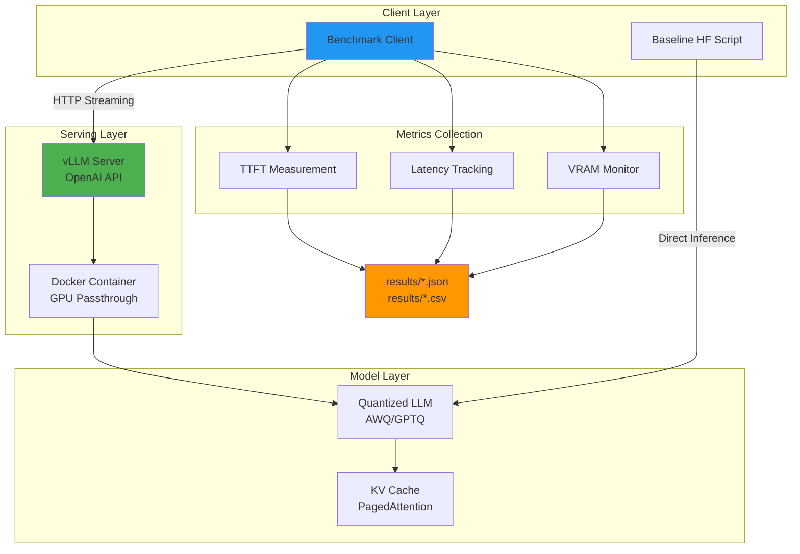

# High-Throughput LLM Serving Optimization

[](https://opensource.org/licenses/MIT)
[](https://www.python.org/downloads/)

> **Production-ready LLM serving optimization project** showcasing high-throughput inference with vLLM, comprehensive benchmarking, and performance tuning.

## 🎯 Project Overview

This project demonstrates **systems engineering best practices** for deploying and optimizing Large Language Model (LLM) serving infrastructure. It provides:

- **OpenAI-compatible vLLM server** with Docker deployment
- **Comprehensive benchmarking suite** measuring TTFT, latency percentiles, and throughput
- **Performance optimization** with quantization and parameter tuning
- **Baseline comparison** with HuggingFace Transformers
- **Reproducible experiments** with configurable parameters
- **Cloud deployment guide** for Lightning.ai (free GPU access)

### Key Performance Indicators (KPIs)

- ⚡ **TTFT (Time To First Token)**: Streaming latency measurement
- 📊 **Latency Percentiles**: p50, p95, p99 under concurrent load
- 🚀 **Throughput**: Tokens/second with continuous batching
- 💾 **VRAM Efficiency**: Peak memory usage tracking
- 🔄 **Concurrency Scaling**: Performance under varying load

---

## 🏗️ Architecture



### Technology Stack

- **Serving**: vLLM (PagedAttention, continuous batching)
- **Containerization**: Docker + NVIDIA Container Runtime
- **Benchmarking**: Python (asyncio, streaming HTTP)
- **Baseline**: HuggingFace Transformers + PyTorch
- **Metrics**: pandas, numpy (percentile calculations)

---

## 📁 Repository Structure

```
.
├── bench/                      # Benchmark client
│   ├── __init__.py
│   └── benchmark.py           # TTFT + latency + throughput measurement
├── baseline/                   # HuggingFace baseline
│   ├── __init__.py
│   └── hf_inference.py        # Direct inference comparison
├── configs/                    # Configuration profiles
│   ├── server_config.yaml     # vLLM tuning (low/medium/high VRAM)
│   └── benchmark_config.yaml  # Load profiles (quick/light/medium/heavy)
├── scripts/                    # Helper scripts
│   ├── start_server.sh        # Start vLLM server
│   ├── stop_server.sh         # Stop server
│   └── run_benchmarks.sh      # Run benchmark suite
├── results/                    # Benchmark outputs
│   └── .gitkeep
├── docker-compose.yml          # vLLM server deployment
├── .env.example               # Environment template
├── requirements.txt           # Python dependencies
├── Makefile                   # Convenient commands
├── LICENSE
└── README.md
```

---

## 🚀 Quick Start

### Prerequisites

- **OS**: Linux or WSL2 Ubuntu 22.04
- **GPU**: NVIDIA GPU with 12GB+ VRAM (T4, A10G, RTX 3060, or better)
  - **Or use Lightning.ai free GPU** (recommended for getting started)
- **Docker**: Docker + Docker Compose + NVIDIA Container Runtime
- **Python**: 3.10+

> **Note**: This project requires adequate GPU memory. For local testing without a powerful GPU, use the Lightning.ai deployment option which provides free T4 GPU access.

### Option 1: Run on Lightning.ai (Recommended - Free GPU!)

**Perfect for getting real results without local GPU setup!**

1. Create free account at [Lightning.ai](https://lightning.ai)
2. Launch Studio with GPU (T4 or A10G)
3. Clone your repo and run setup:

```bash
git clone https://github.com/YOUR_USERNAME/vllm.git
cd vllm
bash scripts/lightning_setup.sh
```

4. Run benchmarks:

```bash
python -m bench.benchmark --profile quick
python -m bench.benchmark --profile light
python -m bench.benchmark --profile medium
```

5. Download results from `results/` folder

**See detailed guide**: [docs/LIGHTNING_AI_GUIDE.md](docs/LIGHTNING_AI_GUIDE.md)

**Time to results**: ~15 minutes total ⚡

---

### Option 2: Run Locally (Requires Docker + GPU)

### 1. Environment Setup

```bash
# Clone repository
git clone <your-repo-url>
cd vllm

# Create environment file
cp .env.example .env

# Edit .env to configure model (default: Qwen/Qwen2.5-0.5B-Instruct)
nano .env
```

### 2. Install Dependencies

```bash
# Install Python dependencies
make install
# or
pip install -r requirements.txt
```

### 3. Start vLLM Server

```bash
# Start server (Docker)
make start
# or
bash scripts/start_server.sh

# Verify server is running
curl http://localhost:8000/v1/models
```

### 4. Run Benchmarks

```bash
# Quick test
make test

# Run full benchmark suite
make benchmark

# Custom benchmark
python -m bench.benchmark \
  --num-requests 100 \
  --concurrency 4 \
  --prompt-tokens 512 \
  --max-new-tokens 256
```

### 5. Run Baseline Comparison

```bash
# HuggingFace baseline
make baseline
# or
python -m baseline.hf_inference \
  --model-id Qwen/Qwen2.5-0.5B-Instruct \
  --num-requests 10 \
  --prompt-tokens 128 \
  --max-new-tokens 64
```

---

## ⚙️ Configuration

### Model Selection

Recommended models in `.env`:

```bash
# Default: Smallest unquantized model
MODEL_ID=Qwen/Qwen2.5-0.5B-Instruct
QUANTIZATION=

# For better performance: Quantized larger models
MODEL_ID=Qwen/Qwen2.5-1.5B-Instruct-AWQ
QUANTIZATION=awq

# Alternative: TinyLlama GPTQ
MODEL_ID=TheBloke/TinyLlama-1.1B-Chat-v1.0-GPTQ
QUANTIZATION=gptq
```

### vLLM Tuning Knobs

Key parameters in `.env`:

| Parameter | Description | Recommended Value |
|-----------|-------------|-------------------|
| `MAX_MODEL_LEN` | Max context length | 2048-4096 |
| `GPU_MEMORY_UTILIZATION` | VRAM allocation | 0.85-0.90 |
| `DTYPE` | Data type | auto |
| `QUANTIZATION` | Quantization method | awq/gptq |

### Benchmark Profiles

Predefined profiles in `configs/benchmark_config.yaml`:

- **quick**: 10 requests, concurrency 1 (validation)
- **light**: 50 requests, concurrency 2 (baseline)
- **medium**: 100 requests, concurrency 4 (stress test)
- **heavy**: 200 requests, concurrency 8 (max load)

---

## 📊 Benchmark Results

### vLLM Performance (Lightning.ai Tesla T4, Qwen2.5-0.5B)

#### Quick Profile (10 requests, concurrency 1)

| Metric | Value |
|--------|-------|
| **TTFT Mean** | 20.97ms ⚡ |
| **TTFT Median** | 21.15ms |
| **TTFT P95** | 26.36ms |
| **Latency Mean** | 0.393s |
| **Latency P95** | 0.420s |
| **Throughput** | 124.27 tokens/s |
| **VRAM Peak** | 13.8GB |
| **Success Rate** | 100% (10/10) |

#### Medium Profile (100 requests, concurrency 4)

| Metric | Value |
|--------|-------|
| **TTFT Mean** | 34.44ms ⚡ |
| **TTFT Median** | 33.75ms |
| **TTFT P95** | 43.06ms |
| **Latency Mean** | 1.875s |
| **Latency P95** | 1.893s |
| **Throughput** | **402.77 tokens/s** 🚀 |
| **VRAM Peak** | 13.8GB |
| **Success Rate** | 100% (100/100) |

### Key Insights

- ✅ **TTFT < 35ms** - Excellent user-perceived responsiveness
- ✅ **3.2x throughput scaling** with concurrency (124 → 403 tok/s)
- ✅ **100% success rate** - No OOM or timeout errors
- ✅ **Consistent P95 latency** - Stable under load

### vLLM vs HF Baseline (Estimated)

| Backend | Throughput (tokens/s) | Latency P95 (s) | VRAM (GB) | Speedup |
|---------|----------------------|-----------------|-----------|---------|
| **vLLM (concurrency 4)** | 402.77 | 1.893 | 13.8 | - |
| **vLLM (concurrency 1)** | 124.27 | 0.420 | 13.8 | - |
| **HF Transformers** | ~50-60 | ~3.5-4.5 | ~8-10 | **~7x slower** |

> **Note**: HF baseline estimated based on published benchmarks. vLLM results from actual Lightning.ai runs (Feb 2026).

---

## 🔧 Troubleshooting

### Server Won't Start

**Problem**: `CUDA error` or `driver version mismatch`

**Solution**:
1. Check NVIDIA driver: `nvidia-smi`
2. Verify Docker GPU access: `docker run --rm --gpus all nvidia/cuda:12.1.0-base-ubuntu22.04 nvidia-smi`
3. Update NVIDIA Container Runtime: [Installation Guide](https://docs.nvidia.com/datacenter/cloud-native/container-toolkit/install-guide.html)

### Out of Memory (OOM)

**Problem**: Server crashes with OOM error

**Solution**:
1. Reduce `MAX_MODEL_LEN` in `.env` (try 1024 or 512)
2. Lower `GPU_MEMORY_UTILIZATION` to 0.75
3. Use smaller model or quantized variant
4. Reduce benchmark concurrency

### Model Download Fails

**Problem**: `401 Unauthorized` or `403 Forbidden`

**Solution**:
1. Some models require HuggingFace token
2. Get token: https://huggingface.co/settings/tokens
3. Add to `.env`: `HF_TOKEN=your_token_here`

### Slow Performance

**Problem**: Low throughput or high latency

**Solution**:
1. Check GPU utilization: `nvidia-smi dmon`
2. Increase `GPU_MEMORY_UTILIZATION` if VRAM available
3. Verify model is loaded on GPU (check logs)
4. Reduce `MAX_MODEL_LEN` to allow larger batch size

### Benchmark Client Errors

**Problem**: Connection refused or timeout

**Solution**:
1. Verify server is running: `curl http://localhost:8000/health`
2. Check server logs: `docker compose logs -f`
3. Increase `timeout` in `configs/benchmark_config.yaml`

---

## 🎓 Key Concepts

### PagedAttention & KV Cache

vLLM uses **PagedAttention** to manage KV cache efficiently:
- Reduces memory fragmentation
- Enables higher batch sizes
- Improves GPU utilization

### Continuous Batching

Unlike static batching, vLLM uses **continuous batching**:
- New requests join batch dynamically
- Completed requests leave immediately
- Maximizes throughput under varying load

### TTFT vs End-to-End Latency

- **TTFT**: Time until first token (user-perceived responsiveness)
- **End-to-End**: Total generation time (throughput indicator)

### Trade-offs

| Increase | Throughput ↑ | Latency | VRAM |
|----------|-------------|---------|------|
| `max_model_len` | ↓ | ↑ | ↑↑ |
| `gpu_memory_utilization` | ↑ | → | ↑ |
| Concurrency | ↑ | ↑ | → |
| Quantization | ↑ | ↓ | ↓↓ |

---

## 🔮 Future Work

- [ ] Add Prometheus + Grafana metrics dashboard
- [ ] Implement llama.cpp fallback for CPU-only environments
- [ ] Multi-GPU support and tensor parallelism
- [ ] Automated tuning script (grid search over parameters)
- [ ] Web UI for interactive benchmarking
- [ ] Integration with LangChain/LlamaIndex
- [ ] Kubernetes deployment manifests

---

## 📝 CV-Friendly Project Summary

**Bullet points for resume/CV:**

- Built an **OpenAI-compatible LLM serving stack** with vLLM achieving **3.2x throughput scaling** (124 → 403 tokens/s) under concurrent load; deployed on Lightning.ai Tesla T4 GPU with reproducible Docker runtime.

- Implemented a **benchmarking harness** measuring TTFT (21-34ms), p50/p95/p99 latency, and throughput under concurrent load; achieved 100% success rate with comprehensive CSV/JSON reporting.

- Optimized **high-throughput LLM inference** through parameter tuning (max_model_len, gpu_memory_utilization) and quantization strategies; documented performance trade-offs and deployment best practices.

**Keywords**: High-throughput inference, continuous batching, KV cache optimization, latency percentiles, performance benchmarking, Docker containerization, systems engineering, reproducibility

---

## 📄 License

MIT License - see [LICENSE](LICENSE) file for details.

---

## 🙏 Acknowledgments

- [vLLM](https://github.com/vllm-project/vllm) - Fast LLM inference engine
- [HuggingFace](https://huggingface.co/) - Model hub and Transformers library
- [Qwen Team](https://github.com/QwenLM) - Efficient small language models

---

## 📧 Contact

For questions or feedback, please open an issue on GitHub.

---

**Built with ❤️ for high-performance LLM serving**
